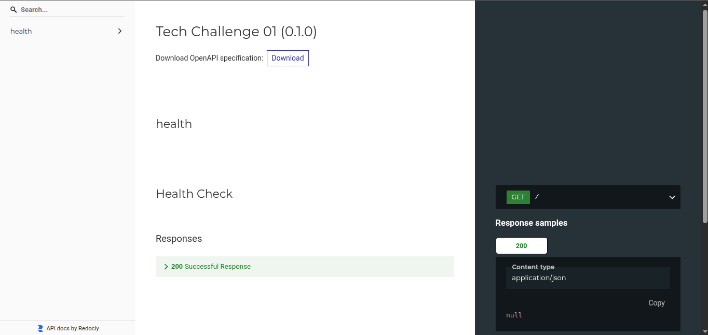

## 🚀 Tech Challenge 01

### 📋 Índice
- [Sobre](#-sobre)
- [Pré-requisitos](#-pré-requisitos)
- [Instalação e configuração](#-instalação-e-configuração-do-projeto)
- [Documentação das rotas](#-documentação-das-rotas)
- [Estrutura do projeto](#-estrutura-do-projeto)
- [Arquitetura](#-arquitetura-do-projeto)


### 💡 Sobre

Descrição sobre o projeto

### 📋 Pré-requisitos
- [Pyenv - gerenciador de versões Python](https://github.com/pyenv/pyenv)
- [Poetry - gerenciador dependências Python](https://python-poetry.org/docs)


### 🔧 Instalação e Configuração do projeto

**Instalação da versão do Python** 

O comando abaixo é responsável por realizar a instalação da versão do Python utilizada no projeto:

```bash 
   pyenv install $(cat .python-version)
```

**Instalação das dependências do projeto:** 

Esse comando irá realizar a instalação de todas as dependências para rodar o projeto, como `uvicorn`, `fastApi`, entre outras:

```
    poetry install
```

**Execução do projeto em ambiente de desenvolvimento:** 

O comando abaixo é responsável por realizar a execução da aplicação em ambiente de desenvolvimento:

```bash 
    poetry run uvicorn app.main:app --reload --host 0.0.0.0 --port 8000
```

### 📔 Documentação das rotas
Localmente é possível realizar o acesso a documentação das rotas através do seguinte link:

```
http://localhost:8000/redoc
```



### 📂 Estrutura do projeto

``` bash
📦 main
 ┣ 📂 app
 ┣ 📂 data
 ┣ 📂 doc
 ┗ 📂 scripts
```

### 📐 Arquitetura do projeto

Aqui será descrito como será a estrutura de comunicação, passagem de dados, segurança, entre outros