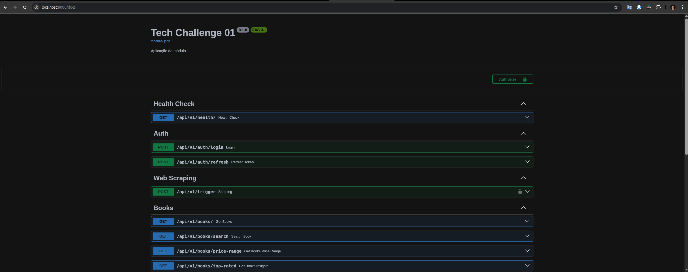
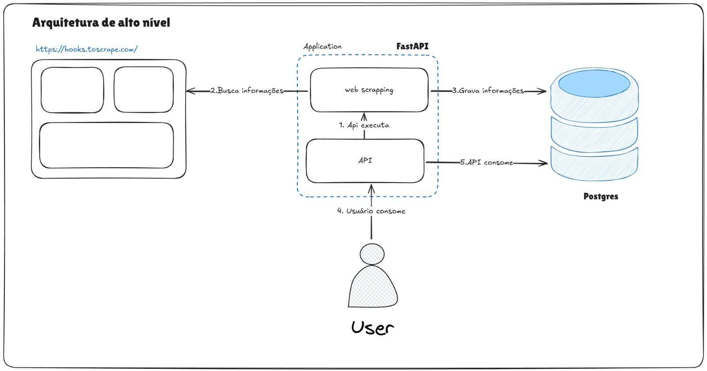
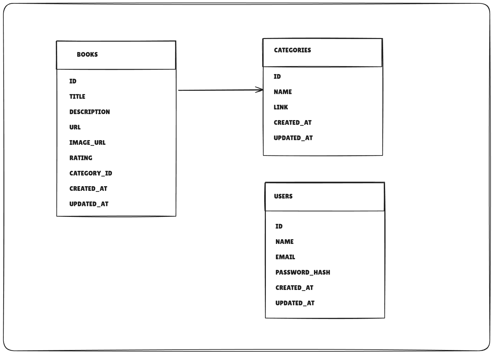

## 🚀 Tech Challenge 01

### 📋 Índice
- [Sobre](#-sobre)
- [Pré-requisitos](#-pré-requisitos)
- [Instalação e configuração](#-instalação-e-configuração-do-projeto)
- [Documentação das rotas](#-documentação-das-rotas)
- [Estrutura do projeto](#-estrutura-do-projeto)
- [Arquitetura](#-arquitetura-do-projeto)

### 💡 Sobre

Projeto com objetivo educacional. Coleta pro raspagem de site fictício de vendas de livros para composição de base de dados para análise e predição.

### 📋 Pré-requisitos
- [Pyenv - gerenciador de versões Python](https://github.com/pyenv/pyenv)
- [Poetry - gerenciador dependências Python](https://python-poetry.org/docs)

### 🔧 Instalação e Configuração do projeto

**Instalação da versão do Python** 

O comando abaixo é responsável por realizar a instalação da versão do Python utilizada no projeto:

```bash 
   pyenv install $(cat .python-version)
```

**Instalação do Poetry** 

O comando abaixo é responsável por realizar a instalação do Poetry no projeto:

```bash 
   pip install poetry
```

**Instalação das dependências do projeto:** 

Esse comando irá realizar a instalação de todas as dependências para rodar o projeto, como `uvicorn`, `fastApi`, entre outras:

```
    poetry install
```

**Execução do projeto em ambiente de desenvolvimento:** 

O comando abaixo é responsável por realizar a execução da aplicação em ambiente de desenvolvimento:

```bash 
    fastapi run app/main.py --reload  
```

### 📔 Documentação das rotas
Localmente é possível realizar o acesso a documentação das rotas através do seguinte link:

```
http://localhost:8000/docs
```



### 📂 Estrutura do projeto

``` bash
📦 main
 ┗ 📂 app
    ┣ controllers
    ┣ core
    ┣ data
    ┣ dtos
    ┣ models
    ┣ services
    ┗ utils
```

### 📐 Arquitetura do projeto



### Segurança
A API exige apresentação de token fornecido no momento da autenticação via usuário e senha através da rota "api/v1/trigger/auth/login". As rotas "/api/v1/users" fornecem opções para gerenciamento de usuários da API.

### Ingestão de dados
A rota "api/v1/trigger" coleta o site "https://books.toscrape.com/", organiza em livros e categorias e persiste o dado no PostgreSQL.

### Machine Learning
As rotas "/api/v1/ml" acionam o aprendizado de maquina para criação dos modelos baseado nos dados persistidos no banco.

### Analytcs
As rotas "/api/v1/categories", "/api/v1/stats", "api/v1/categories" e "api/v1/books" fornecem relatórios sobre os dados coletados e os modelos de IA gerados.


### 📐 Modelo de dados

